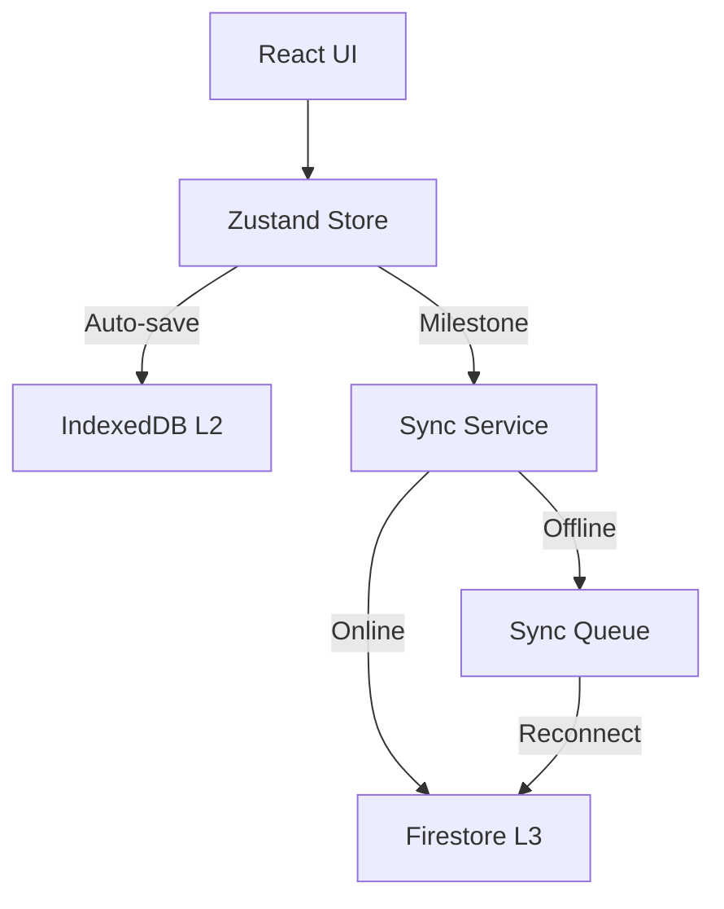

# SurveyOS Prime V2 — Technical Deep Dive & Architecture

SurveyOS Prime V2 is a mission-critical, AI-powered survey management platform designed for IRDAI-licensed independent motor surveyors in India. It transitions the legacy manual workflow into a high-performance, offline-first digital experience.

---

## 🏗 Architecture Overview

SurveyOS is built as a **Static Web App (SWA)** deployed on Firebase Hosting, leveraging a sophisticated 3-layer persistence model to ensure zero data loss in the field.

### 1. Persistence Layers
| Layer | Technology | Purpose |
| :--- | :--- | :--- |
| **L1: In-Memory** | Zustand | Real-time UI state and active claim editing. |
| **L2: Local Disk** | IndexedDB | High-capacity persistence (including photos). Encrypted at rest. |
| **L3: Cloud** | Firestore | Global sync for cross-device access and multi-user collaboration. |

### 2. Cloud Sync Strategy (Layer 3)
The sync engine uses a **"Milestone Push"** approach rather than real-time debouncing to minimize Firestore writes and battery drain.
- **Push Triggers:** Tab switching, claim switching, or manual save.
- **Queue System:** If offline, edits are queued in IndexedDB and automatically drained when `navigator.onLine` returns true.
- **Conflict Resolution:** "Latest Update Wins" based on a `updatedAt` ISO timestamp.
- **Exclusion Logic:** Photos are *never* stored in Firestore (due to size/cost). They stay local or sync to the user's private Google Drive.



---

## 🧠 AI & Data Engine

The "Brain" of SurveyOS is located in `src/lib/ai` and `src/lib/calculations`.

### 1. Document Extraction
Uses Gemini 1.5 Pro / Flash (via `bramha` cloud functions) to extract structured JSON from:
- **RC Books:** Registration No, Chassis, Engine, Make/Model.
- **Driving Licences:** DL No, Expiry, Class of Vehicle.
- **Insurance Policies:** Policy No, Period, IDV, Limits.

### 2. IRDAI Calculation Engine
The assessment logic (`src/lib/calculations/assessment.ts`) is a strict port of the master industry formulas:
- **Depreciation:** Age-based metal scale (0% to 50%) + fixed Glass (0%), Plastic (50%), Fiberglass (30%) rules.
- **Taxation:** Dynamic GST (CGST/SGST/IGST) calculation per line item.
- **CTL Detection:** Automatic Constructive Total Loss flag if Net Loss ≥ 75% of IDV.

---

## 🔄 The Survey Lifecycle (Core Workflow)

The application is structured around 13 integrated tabs that guide a surveyor from site inspection to final report submission.

1. **SpotTab:** Real-time data entry at the accident site.
2. **DetailsTab:** Core vehicle and policy data (Auto-filled via AI).
3. **DocumentsTab:** OCR processing for RC, DL, and Insurance PDFs.
4. **PhotosTab:** Local-first photo gallery with compression and categorization.
5. **AssessmentTab:** Line-item breakdown of parts, labor, and depreciation.
6. **BillCheckTab:** Verification of repairer bills against survey estimates.
7. **ValuationTab:** Market research and Pre-accident Value (PAV) calculation.
8. **ReinspectionTab:** Verification of repairs post-completion.
9. **FeesTab:** Professional fee calculation based on claim size.
10. **ReportTab:** Live preview and export of PDF/Word/Excel reports.
11. **ReviewTab:** Global quality check and AI-narrative generation.
12. **CloudVaultTab:** Google Drive sync for long-term photo archiving.
13. **ProfileTab:** Surveyor credentials and digital signature management.

---

## 🤖 AI Routing & Intelligence

SurveyOS doesn't rely on a single model. It uses a **Multi-Model Routing Layer** to optimize for cost, speed, and accuracy:

- **Gemini 1.5 Pro:** Used for complex OCR and policy analysis where high context is required.
- **Llama 3.3 (via Groq/OpenRouter):** Default for generating natural language report narratives due to high speed.
- **Deepseek/NVIDIA NIM:** Backup routing for high-load scenarios.

### Logic Flow:
1. User uploads a document.
2. `lib/ai/extractor.ts` identifies the document type.
3. The prompt is sent to the "Admin-Preferred" model (configured in Firestore).
4. Results are returned as structured JSON and auto-hydrated into the Zustand store.

---

## 🔐 Advanced Security Protocols

### 1. Cross-Site Scripting (XSS) Mitigation
All dynamic HTML report previews use `DOMPurify` before being rendered via `dangerouslySetInnerHTML`. This ensures that even if malicious data enters the assessment line items, it cannot execute scripts in the browser.

### 2. API Key Management
- **Local Encryption:** User-provided AI keys (Gemini, Groq) are stored in encrypted `localStorage`.
- **Firebase Secret Manager:** System-level keys (Firebase Admin, Email SMTP) are stored as Firebase Secrets and never exposed to the client.

### 3. Role-Based Access Control (RBAC)
Auth is managed via Firebase Auth with custom security rules. New users are locked in a "Pending Approval" state until manually approved by an admin via the dashboard.

---

## 🛠 Developer Workflow

### Installation
```bash
npm install
# Set up .env.local with Firebase keys
npm run dev
```

### Key Directories
- `/src/stores`: Modular Zustand slices (Vehicle, Assessment, AI).
- `/src/components/tabs`: The 13 primary workflow stages.
- `/src/lib/storage`: IndexedDB lifecycle management.
- `/functions`: Firebase Cloud Functions for AI processing and PDF merging.

### Detailed Directory Breakdown
| Directory | Responsibility |
| :--- | :--- |
| `src/app` | Next.js App Router (Layouts, Routing, Global Contexts). |
| `src/components/tabs` | Feature-specific logic for each stage of the survey (Vehicle, Assessment, etc.). |
| `src/components/ui` | Atomic design system (Buttons, Cards, Inputs) with Glassmorphism. |
| `src/lib/calculations` | IRDAI-compliant math engine for depreciation and GST. |
| `src/lib/ai` | AI client implementation, prompt templates, and routing logic. |
| `src/lib/storage` | Local persistence via `dexie` (IndexedDB). |
| `src/stores` | Global state (Zustand) with sliced architecture for performance. |

---

## 🚀 Performance & Scale
- **Web Worker PDF Generation:** Heavy report rendering happens in background threads to keep the UI at 60fps.
- **Canvas-Based Compression:** Photos are resized to 1600px max-width before storage, reducing IndexedDB footprint by ~80%.
- **Differential Sync:** Only changed fields are pushed to Firestore during "Milestone" saves.

---

*Designed for the elite surveyor. Built with Antigravity.*
