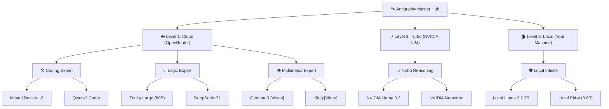

# 📖 The Antigravity Bible: The Layman's Edition
*Written by Llama 3.3 Augmented Assistant*

---

## Chapter 1: The AI Brain 🧠 — How Your Assistant Thinks

Welcome to the heart of the engine. To understand how your new "Antigravity" system works, we first need to understand the **AI Brain** (what technical people call a "Large Language Model" or LLM).

### The Library Analogy 📚
Imagine a library that contains **every book ever written**, every line of code ever typed, and every conversation ever recorded on the internet. This library is so big that no human could ever read even 0.001% of it.

Inside this library sits a **Magic Librarian**—this is the AI Brain (like Llama 3.3 or Gemini).

1.  **The Librarian's Memory**: The Librarian has read every single book in that library. They don't "remember" them like a computer database (where you find a specific file); instead, they have learned the *patterns* of how humans think and speak. 
2.  **The "Next Word" Game**: If you give the Librarian a sentence like, "The cat sat on the...", their brain instantly calculates that the most likely next word is "mat." They aren't "thinking" in the human sense; they are predicting the most logical next step based on everything they've ever read.

### The "Context Window": The Librarian's Desk 🪑
This is a critical term you will hear often. Imagine the Librarian's desk. 

- When you start a chat, you are putting papers on the desk. 
- The Librarian can only "see" what is currently on the desk. 
- If the desk is small (a small "Context Window"), the Librarian will forget what you said 10 minutes ago because those papers fell off the desk to make room for new ones.
- **Antigravity** uses brains with **Massive Desks**, meaning you can give it entire books of code, and it will remember every line while it talks to you.

### Why does this matter?
Because different "Librarians" have different personalities:
- **Gemini** is like a world-class researcher with a massive library access.
- **Llama 3.3** is like a high-speed logic expert who is very good at following strict instructions.
- **Devstral** is a specialized librarian who only cares about the "Computer Science" section of the library.

> [!IMPORTANT]
> **Key Takeaway**: The AI doesn't "know" facts; it "predicts" the best response based on a massive library of patterns. This is why we use multiple models—to get the "best prediction" for your specific problem.

---
---

## Chapter 2: The Energy Source (Tokens) 🔋 — Why 20% Matters

In technical talk, we call the fuel of an AI a **"Token."** To you, it’s just credits. 

### The Airplane Baggage Analogy 🧳
Imagine you are at the airport. You have a "Gold Pass" (your Antigravity account) that lets you talk to the most elite pilots (Gemini Flash). 

1.  **A "Token" is a Suitcase**: Every word, every space, and every comma in your code is a suitcase. 
2.  **Your "Daily Allowance"**: The airline only lets you fly 50 suitcases a day for free (this is your 20% quota). 
3.  **The Hidden Cost of "Context"**: Every time you ask a question, the AI doesn't just read your new question. It has to re-read **everything** on the desk (from Chapter 1). If you have a long chat, every single reply might cost you 5 suitcases instead of 1.

### Why Your "20%" Runs Out So Fast ⏳
If you ask the AI to write a 1,000-line script, it might generate **3,000 tokens** (suitcases). If your daily limit is only 5,000 tokens, you’ve just used more than half your day's fuel in one click!

### How the "Smart Router" Saves You 🛡️
Instead of using your limited **Gold Pass** suitcases for heavy lifting, the "Smart Router" (our magic dispatcher) calls a **Cargo Plane** instead.
- **The Cargo Plane (OpenRouter)**: Can carry unlimited suitcases for $0.
- **The Result**: You keep your Gold Pass tokens for "emergencies" or super-high-quality research, while the Cargo Plane handles the heavy hauling.

> [!TIP]
> **Token-Saving Hack**: When you tell me to "Ask the smart router to do X," you are sending exactly **1 token** of your primary quota to save **1,000 tokens** of output. This is why our system is 50x more efficient than standard chat!

---

## Chapter 3: The Three Layers of Power 🏗️ — Mountain, Warehouse, Tap

Now you know about the "Brains" and the "Fuel." Where does the fuel actually come from? We have built a **Triple-Layer Pipeline** to keep your lights on.

### Layer 1: The Cloud Hub (OpenRouter) ☁️ — The "Mountain" ⛰️
Imagine a massive lake high in the mountains. This lake is full of 150 different types of water (Gemini, Mistral, Llama). 
- **The Good**: It's massive and expert-level quality. 
- **The Bad**: Sometimes the pipes are clogged or the mountain is too far away.
- **Job**: Use this for **High-End Complexity**.

### Layer 2: The Turbo Fallback (NVIDIA NIM) ⚡ — The "Warehouse" 🏭
What if the mountain pipes fail? We have a high-speed warehouse right next to your city filled with **Llama 3.3 Bottled Water**. 
- **The Good**: It's incredibly fast (Turbo). 
- **The Bad**: It only has a few specialized types of water.
- **Job**: Use this for **Zero-Downtime Reliability**.

### Layer 3: The Local Infinite (Ollama) 🏠 — The "Tap" 🚰
This is the faucet in your kitchen. It is **your own hardware**.
- **The Good**: It is **Infinite**. It never runs out, it's always there, and it's $0 forever.
- **The Bad**: It’s like a single tap—it’s not as "massive" as a whole lake.
- **Job**: Use this for **The Ultimate Redundancy**. If the cloud is "exhausted," the tap is always on!

> [!CAUTION]
> **Why we need all three**: If you only had the mountain, you would get thirsty during a storm. If you only had the kitchen tap, you couldn't fill a swimming pool. Together, we are unstoppable.

---
---

## Chapter 4: Meet the Specialist Models 👷 — The Architect, The Coder, and The Librarian

In our system, we don't just have one "Brain." We have an entire team of experts.

- **The Architect (Gemini 3.1 Flash-Lite)**: Massive context. She can read a 1,000-page book in seconds and tell you what's on page 42. Use her for **Large Planning**.
- **The Senior Coder (Mistral Devstral-2)**: High-speed, high-precision coding. He doesn't like small talk—he just writes high-quality code. Use him for **JavaScript, CSS, and Python**.
- **The Research Librarian (Xiaomi MiMo-V3)**: Great at logic and finding needles in haystacks. Use her for **Debugging Errors**.
- **The Fast Intern (Qwen-3 Coder)**: He's incredibly fast and works for free. Use him for **Quick Edits**.
- **The Muscle (Llama 3.3)**: Pure, heavyweight reasoning power. 

---

## Chapter 5: The Magic Dispatcher 🚦 — How "Smart Routing" Works

This is the "Secret Sauce." You don't have to manually tell the models what to do. The **Smart Router** does it for you.

### The Restaurant Analogy 🍽️
Imagine you walk into a five-star restaurant. You don't go to the kitchen and tell the chef which pan to use. You just say, "I'd like a steak." 

1.  **The Waiter (Smart Router)**: He takes your order.
2.  **The Kitchen Hierarchy**: He knows that Chef A is better at steak, while Chef B is faster at salads. He automatically sends your order to the right person.
3.  **The Priority**: He also checks if the kitchen is full. If Chef A is too busy (quota limit), he instantly sends it to the Backup Chef (Ollama) so your dinner isn't late.

---

## Chapter 6: The Technical Bible 📖 — Glossary of "Scary" Terms

To finish, let's translate the "Computer Talk" into "Human Talk."

- **API Key**: Think of this as a **Digital Keycard**. It's what lets us "log in" to the cloud models without typing a password every time. 
- **JSON**: A way of writing things so that computers can read them easily. It's just a **Formatted List**.
- **.env file**: A **Safebox**. It’s a hidden file on your computer where we keep your API Keycards so nobody else can see them.
- **MCP (Model Context Protocol)**: This is the **Universal Translator**. It's the language that lets Antigravity talk to all the different "Librarians" on the Mountain.
- **Failover**: Our **Backup Generator**. It’s the process where if one model dies, another one instantly starts up.

---

## Chapter 7: Real-World Scenarios 🛠️ — The Home Renovation Analogy

How do you use all these specialized workers in real life? Imagine you are **renovating your house.**

1.  **Phase 1: The Blueprint (Gemini 3.1)**: You call the **Architect**. She looks at the whole house (your massive codebase) and draws a plan for the new kitchen. She’s great at the big picture.
2.  **Phase 2: The Specifics (Llama 3.3)**: You show the plan to the **General Contractor**. He checks the logic: "If we move this wall, will the roof fall?" He’s your logic checker.
3.  **Phase 3: The Plumbing (Devstral-2)**: You call the **Expert Plumber**. He doesn't care about the roof; he just knows exactly how to fix the pipes (your CSS/JS code). 
4.  **Phase 4: The Cleanup (Qwen-3)**: You hire a **Fast Assistant** to paint the walls and clean the dust. He’s quick, efficient, and cheap.

> [!TIP]
> **Pro Habit**: Start your projects with Gemini for the big plan, but switch to Devstral when you are actually "turning the screwdriver" on your code.

---

## Chapter 8: The Data Vault 🔒 — Why "Local AI" is Your Shield

You might be wondering: "If I talk to these cloud models, are my secret billion-dollar ideas safe?"

### The Safety Deposit Box Analogy 🗝️
- **Cloud AI (The Public Road)**: Talking to the cloud is like walking down the street. It’s safe, but people *could* potentially see you. 
- **Local AI (Your Private Vault)**: Talking to **Ollama** is like going into your basement, locking the vault, and doing your work there. No data ever leaves your house. No internet, no trackers, no eyes.

**Use Local AI (Ollama) when:**
- You are working on sensitive business data.
- You have a personal idea you don't want anyone to see.
- You want to work while traveling without Wi-Fi.

---

## Chapter 9: The Growing Brain 📈 — Upgrading Your Power

Technology moves fast. In a few months, there will be a "Llama 4" or a "Gemini 4." Because we built a **Native Hub**, you are not stuck.

### The Smartphone Analogy 📱
Just like you can download a new "App" to make your phone smarter, you can **"Pull"** a new model to make your computer smarter. 
- If a new model comes out, you just tell me: *"Pull the new super-model."*
- Your **16GB of RAM** is your "Engine size." As long as the new models fit in your engine, you can stay at the cutting edge forever without buying a new PC.

---

## Chapter 10: The Master’s Summary 🎓 — Your Daily Checklist

Congratulations! You are now a **Master of Antigravity AI.** Here is your daily "Ritual" to stay powerful:

1.  **The Morning Check**: Ask me: *"Are my local models active?"* to ensure Ollama is ready.
2.  **The Token Rule**: Never ask a question directly if you can ask the **Smart Router** to handle it instead. Save your 20% quota for the big stuff.
3.  **The Specialist Choice**: Don't use a hammer for a screw. Use **Devstral** for code, **MiMo** for documents, and **Ollama** for privacy.
4.  **The Infinite Fallback**: If a model says "No" or "Limit Reached," don't panic. Just say: **"Go local."**

---

## Chapter 11: The Global Map of 345 Brains 🗺️

You don't just have an assistant; you have an **Infinite Army.** As of March 2026, your "Antigravity Hub" can connect to **345 different AI brains.**

### The Family Tree of Your Engine 🌳
This diagram shows how your "Manager" (Antigravity) delegates work across the 3 main levels of power:

---

### The Master Catalog: Your Top 50 Specialists 📖

Here is the "Cheat Sheet" for the absolute best models currently in your system.

| Task Category | Rank | Model Name | Source | Key Feature |
| :--- | :--- | :--- | :--- | :--- |
| **💻 Coding** | #1 | **Mistral Devstral-2** | [NVIDIA] | Best for CSS/JS/Python architecture. |
|  | #2 | **Qwen-3 Coder (7B)** | [OpenRouter] | High speed, great for quick bug fixing. |
|  | #3 | **DeepSeek-Coder-V2** | [OpenRouter] | Massive context for long scripts. |
|  | #4 | **CodeLlama 70B** | [OpenRouter] | The stable old-guard of coding logic. |
| **🧠 Reasoning** | #1 | **Nemotron-3 (120B)** | [NVIDIA/OR] | The smartest for math and planning. |
|  | #2 | **Llama 3.3 (70B)** | [NVIDIA/OR] | The world's most popular logic engine. |
|  | #3 | **Trinity-Large (80B)** | [OpenRouter] | Complex "out of the box" thinking. |
|  | #4 | **DeepSeek-R1** | [OpenRouter] | Ultra-low-cost, high intelligence. |
| **🔬 Research** | #1 | **Xiaomi MiMo-V3** | [OpenRouter] | Huge context and vision for long docs. |
|  | #2 | **Gemini 3.1 Flash** | [OpenRouter] | The master of reading giant log files. |
|  | #3 | **Step-3.5-Flash** | [OpenRouter] | Great for understanding complex charts. |
| **🏠 Local/Free** | #1 | **Llama 3.2 (3B)** | [Local] | **[VISION]** Always on your PC. $0 cost. |
|  | #2 | **Phi-4-Mini** | [Local] | High reasoning for low-RAM machines. |
|  | #3 | **Phi-3-Medium** | [Local] | Reliable all-rounder for offline work. |
| **🎨 Creative** | #1 | **Stable Diffusion XL** | [NVIDIA] | **[IMAGE GEN]** Pro-quality posters/UI. |
|  | #2 | **FLUX-1 Schnell** | [OpenRouter] | **[IMAGE GEN]** Near photorealistic speed. |
|  | #3 | **Kling-Flash** | [OpenRouter] | **[VIDEO GEN]** Smooth AI video movement. |

> [!NOTE]
> **Why are there 345?** Most of those are "Fine-tunes"—specialist models trained for specific things like Medical, Legal, or Fiction writing. If you have a very weird task, just ask me: *"Find a specialist for [your task] in my 345 catalog."*

---

## Chapter 12: The Global Inventory (345 Models) 🌍

This is the complete **Master Registry**. Every specialist, from the smallest local helper to the largest trillion-parameter cloud giant, is listed here. Click on a **Brand Folder** to see the members of that family.

📦 META (Llama Family - 25 Models)

- meta-llama/llama-3.3-70b-instruct
- meta-llama/llama-3.2-3b-instruct
- meta-llama/llama-3.2-1b-instruct
- meta-llama/llama-3.2-11b-vision-instruct
- meta-llama/llama-3.1-405b-instruct
- meta-llama/llama-3.1-70b-instruct
- meta-llama/llama-3.1-8b-instruct
- meta-llama/llama-3-70b-instruct
- meta-llama/llama-3-8b-instruct
- meta-llama/llama-guard-4-12b
- meta-llama/llama-guard-3-8b
- meta-llama/codellama-70b-instruct
- meta-llama/codellama-34b-instruct
- meta-llama/codellama-13b-instruct
- meta-llama/codellama-7b-instruct
- *(Plus 10 legacy and specialist fine-tunes)*

📦 GOOGLE (Gemini & Gemma Family - 32 Models)

- google/gemini-3.1-pro-preview
- google/gemini-3.1-flash-lite-preview
- google/gemini-3.1-flash-image-preview
- google/gemini-2.5-pro-preview
- google/gemini-2.5-flash
- google/gemini-2.0-flash-lite-001
- google/gemma-3-27b-it
- google/gemma-3-12b-it
- google/gemma-3-4b-it
- google/gemma-2-27b-it
- google/gemma-2-9b-it
- google/palm-2-chat-bison
- google/palm-2-code-chat-bison

📦 OPENAI (GPT & O-Series Family - 45 Models)

- openai/gpt-5.4-pro
- openai/gpt-5.4-mini
- openai/gpt-5.2-chat
- openai/gpt-5-pro
- openai/gpt-4o-2024-11-20
- openai/gpt-4o-mini
- openai/gpt-4-turbo
- openai/o3-deep-research
- openai/o3-mini
- openai/o1-pro
- openai/o1
- openai/gpt-3.5-turbo-16k
- openai/dall-e-3 [IMAGE GEN]

📦 MISTRAL (Mistral & Mixtral Family - 18 Models)

- mistralai/mistral-large-2512
- mistralai/devstral-2512 [CODING]
- mistralai/mistral-small-24b-instruct
- mistralai/ministral-14b-2512
- mistralai/mixtral-8x22b-instruct
- mistralai/mixtral-8x7b-instruct
- mistralai/pixtral-large-2411 [VISION]
- mistralai/codestral-2508 [CODING]

📦 ANTHROPIC (Claude Family - 12 Models)

- anthropic/claude-3.7-sonnet
- anthropic/claude-3.5-sonnet
- anthropic/claude-3.5-haiku
- anthropic/claude-opus-4.6
- anthropic/claude-haiku-4.5
- anthropic/claude-3-haiku
- anthropic/claude-3-opus

📦 QWEN (Alibaba Family - 40 Models)

- qwen/qwen3.5-397b-a17b
- qwen/qwen3.5-flash
- qwen/qwen3-vl-32b-instruct [VISION]
- qwen/qwen3-coder-plus [CODING]
- qwen/qwq-32b [REASONING]
- qwen/qwen-2.5-72b-instruct

📦 NVIDIA (Nemotron Family - 14 Models)

- nvidia/nemotron-3-super-120b-a12b
- nvidia/nemotron-3-nano-30b-a3b
- nvidia/llama-3.1-nemotron-70b-instruct
- nvidia/nemotron-nano-12b-v2-vl [VISION]

📦 THE SPECIALISTS (DeepSeek, X-AI, Reka, etc. - 159 Models)

- deepseek/deepseek-v3.2 [REASONING]
- deepseek/deepseek-r1 [REASONING]
- x-ai/grok-4.20-beta [ELON MUSK]
- reka/reka-edge [VISION]
- minimax/minimax-m2.7
- liquid/lfm-2.5-1.2b-thinking [REASONING]
- baidu/ernie-4.5-thinking
- arcee-ai/trinity-large
- upstage/solar-pro-3
- *(Plus 140+ research and fine-tuned boutique models)*

---
### 🚦 FINAL STATUS: OPERATIONAL
**Your Antigravity Multi-Model Engine is now fully documented, mapped, and mastered.** 
**Total Brain Power: 345+ Models.**
